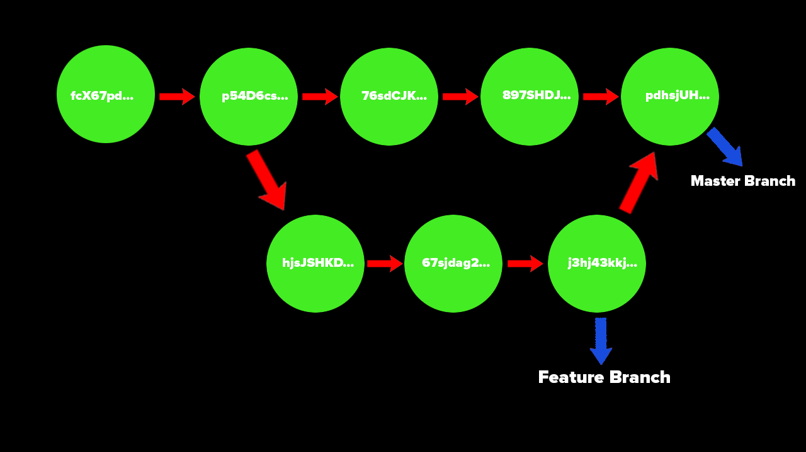

# Git Branches

Each commit within a branch has a hash and each commit references some parent commit that is before it. Commits have messages that detail what happened in that version of the file/project.

Branches allow us to "detach" from this linear timeline of making changes to create our own version of the project. From here we can do whatever we want to the project without affecting the main work. If you find something that works or something you want to add, you can just bring this timeline back into the original one.

The first image is a representation of the linear branch master. The second shows what it looks like when we break off into a feature branch.

## Master Branch

The master branch is the default branch name. This is usually the most official and main branch that everyone on the project uses. The master branch is usually what is deployed/used for the final versions of a project and what the public will see.

However, this does not always have to be the master branch. You can rename this branch to anything you want, or create others and get rid of it.

### master or main

There was a push from GitHub to change the name from master branch to main branch for name convention reasons. Both are still used today and Git still uses master over main which is used by GitHub. Either of them perform the same function, however, you may notice both.

## What is HEAD?

You will see a reference to HEAD a lot when making commits or changes to your branches with Git/GitHub. HEAD is a pointer to your current location in the repository. This is basically where you are in the timeline of the project edits. This HEAD will point to a specific branch reference and refers to a branch pointer.

- Branch Pointer - a reference to where a branch currently is in the timeline. It may be ahead or behind the main timeline.

## Viewing Branches

You are able to view all branches that have been created inside a repository once created. An `*` will be located to the left of the branch you are currently accessing.

To see this, you are going to use the command `git branch -a` to list all branches.

### Creating a New Branch

To create a new branch use `git branch <branch-name>`. This command is just going to create the branch, this will not switch you over to the new branch right away.

To switch to another branch you want to use the command `git switch <branchname>`.

You can also create a new branch and switch to it using the switch command with git. To do this the command you use is

`git switch -c <branchname>`

This command will create the new branch based off where you are right now and then take you to the new branch.

## Merging Branches

A branch works in its own self contained context. However, at some point we want to add the new features we coded back into the original project.
