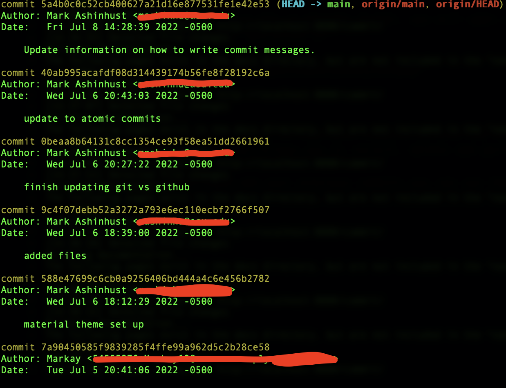

## What is a Commit?

Commits are made as progress in the project is made. These are known as the checkpoints in the project. One can move between these checkpoints to manage versions in the project.

Changes from multiple files and folders can be staged (added) to a new commit. The general process is...

1. Work on Things
2. Make Changes
3. Commit Changes

Commit's can be created, destroyed and edited. With this in mind, you can control what you actually want to commit.

The command to choose what to commit is `git add`. From here the files that want to be committed are chosen and staged to be committed.

### Git Add

This command is used to stage changes for committing. Files can be added, modified, deleted, then once staged, those changes are committed to that version of the project.

Git commit then takes files from this staging area and creates a checkpoint.

Examples of this command are

`git add <filename>`

`git add .` to stage all changed/updated files

### Git Log

All commits that are made are tracked by the system and controlled. This means that you can see when and where in the process all commits are made. Creating detailed commit messages will help keep track of what the commit did and where in the version the project was at in this moment.

Examples of this command are

`git log`

`git log --oneline`

## Commits in Detail

### Atomic Commits

It is said that commits should be atomic. This means that all commits should be singular and only working on one topic and commit those features/changes.

This makes rolling back previous changes much easier at a later time.

## Use Past or Present Tense

It is generally noted that you are to use present tense when writing commit messages. Rather than writing a message that says something was added, you want to say what is happenening. Examples of this include

Use:

`git commit README.md -m "Add comment to readme file"`

Instead of:

`git commit README.md -m "Added comments to the README file"`

You do want to keep in mind how your company or group does their commits. These can vary by team, but should be the same across the team structure.

When doing a commit without the -m message format, you will open a general VIM editor. From here you can just change the message in the editor and write it.

## Git Log

One of the most important ways to view your commits is with the command `git log`. Every time you make a commit, that commit is given a hash that allows you to revisit, delete and perform various other actions.

To view this commit hash and your previous commits you can use the git log command, which looks something like this.

The commit hash are the yellow lines in that photo and correspond with those commits. You can also navigate back from commits based on where the head of your project is. This uses the format HEAD~1 which goes back 1 commit from head and can change. This format will be explained later.

There are far more git log commands that you can use. Just like any other command you can do `git log --help` to gather more information on the command.

Give `git log --oneline` a chance!

## Fix Commits with Amend

If you forgot to do something in your previous commit or wanted to change something you can use the amend/redo command in git.

To do this we still use the `git commit` command but add `--amend` to the end of it. This is how you "redo" a commit.

`git commit --amend`

## Ignore Files in Commit

To ignore files in a git repository there is a special file to define those files. This file is the `.gitignore` file. The directories and files that are listed here will not be tracked by Git and GitHub.

This is great when you want to secure some information or a file. Secrets/API keys will not show up if they are included in this file, which gives privacy to the comapany/creators. This also allows for package and dependency hiding if the project is not completely open source material.
