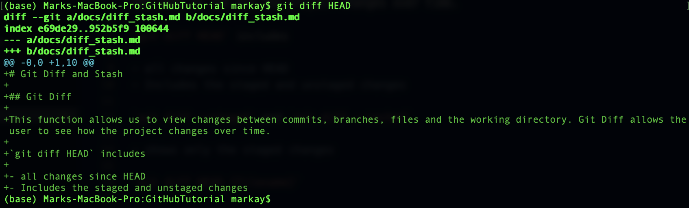

# Git Diff and Stash

## Git Diff

This function allows us to view changes between commits, branches, files and the working directory. Git Diff allows the user to see how the project changes over time.

`git diff HEAD` includes

- all changes since HEAD
- Includes the staged and unstaged changes

`git diff --staged` and `git diff --cached`

- shows only the staged changes

`git diff HEAD {filename}`

`git diff --staged {filename}`

- Show diff changes with just one file

Finding differences between two branches can also be done with `git diff`. This is done with the command

`git diff [branchname1]..[branchname2]`

## Git Stash

Git Stash allows the user to do work on some branch but don't make any commits before changing to another branch. The changes you made will come with you to the destination branch and git will NOT switch if there are any conflicts.

Git stash can also be used to switch branches without bringing changes. Switch without commmiting these changes so there are no unnecessary commits.

`git stash` or `git stash save`

Then you can use git stash pop to pop the most recent stash.

`git stash apply`

- This command is what is used to bring your stashed commit back to the project. This brings it back into the project but does not remove it from the stash.
- Stashed files can be placed into the master branch without commits/merging.

### Multiple Stashes

Multiple stashes can be removed as git stash does everything in order. This is why stashes are popped because they work like a stack.

`git stash apply stash@{2}` to apply a particular stash

To view the list of stashes, the command is `git stash list`

### Dropping and Clearing Stashes

`git stash drop <stash-id>`

`git stash clear`

- This is used to drop certain stashes or all of them.
